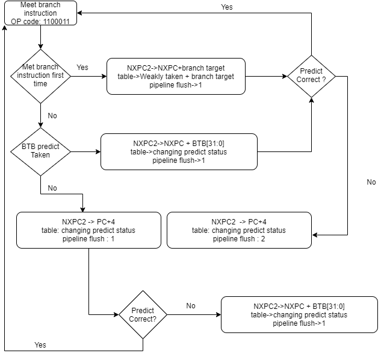
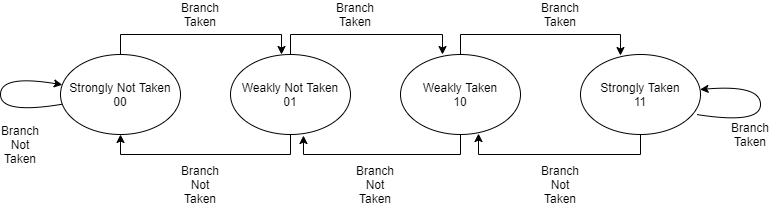

# HaoranGeng's RISC-V Core

 This project is built to practice my computer architecture design skills and to explore the potential 
of RISC-V in depth. This repo keeps updating periodically.
 
## Description
Nowadays, the RISC-V computer architecture is very popular in computer industry. However, I did not learned much RISC-V knowledge from my university. Therefore, I decided to self-study RISC-V and implemented a RISC-V softcore based on
RV32I instruction set. The core is written in verilog and the development tool is Xilinx ISE 14.7. The core is supporting the
the following instructions:
- [X] Immediate Encoding Variants (i.e addi,slli)
- [X] Integer Computional Instructions (i.e add,sub)
- [X] Control Transfer Instructions (i.e beq bne)
- [X] Load and Store Instructions (i.e sw lw)
- [ ] Control and Status Register Instructions (i.e csrrw csrrs)
- [ ] Environment Call and Breakpoints (i.e ecall ebreak)
- [ ] Memory Model Instruction (i.e fence fence.I)

The core is testing using following stragtegies:
- [X] Xilinx ISE simulation
- [ ] Test on Xilinx spartan-6 FPGA
- [ ] Test gcc for RISC-V

In order to explore more possibilities and get better performance, I tried following features on the core:
- [X] Piepline stage
- [ ] Instruction memory cache
- [ ] Data memory cache
- [ ] Cache coherence protocol 
- [ ] Branch predictor
- [ ] Latency insensitive design (LID)
- [ ] Other RISC-V extension
- [ ] Multi-threading

The marked symbol represents the feature that is already been implemented and tested. The other features will be 
implemented in later commit. The performance of the core will be test on Xilinx spartan-6 fpga. The performance 
report and graphics will be generated in later commit.

## Directory
This section is the description of the directory and how to use it
- [RTL] The verilog code of cpu core
	- [core] contains the verilog code of the RISC-V core and a cpu_top_level, which has the core and memory connected
	- [sim] the simulation code for cpu_top_level
(I did not include the file auto generated by Xilinx ISE. To use the core, import core.v, cpu_top_level.v, cpu_ram.mem and cpu_rom.mem into Xilinx ISE and
run the simulation.)
- [Assembler] Contains the python code which changes the RV32I assembly code written on instruction.txt to hex code written on binary_instruction.txt

To use the assembler simply run
```
python assembler.py
```
The result will be written in hex in binary_instruction.txt. Please notice that only the last 8 digits count

- [image] contains the image for the documentation
## Initial Commit (5/6/2020)
Implemented the basic RV32I instruction set (expect csr,break, fence) and tested the instuction through ISim.
Implementation:
1. two-stage piepline 
2. Harvard architecture 
Tested all the implented instuctions 
Example test case gcd algorithm:
```
lw x10,x0,4
lw x11,x0,8
beq x10,x0,16
blt x10,x11,6
sub x10,x10,x11
jal x13,-6
add x12,x10,x0
add x10,x11,x0
add x11,x12,x0
jal x13,-14
sw x0,x12,12
```
It caculates the greatest common divider of 442 and 286 and stores it into the memory. 

The result of simulation


Things to do in next commit:
1. Branch predictor
2. 3-stage piepline
## Second Commit (5/18/2020)
implementation:
1. Change the 2-stage piepline into 3-stage piepline
2. branch history table for branch prediction

Update the originial processor into 3-stage piepline to implemented the branch prediction feature:

1.Adding a new Next pc 2 index of the next 2 instruction

2.Adding the wait state on read-modify-write operation for 3-stage piepline

3.All the previous test on 2-stage design run through the 3-stage design

I also implemented the branch history table which record the branch prediction index and previous branch result.

Things to do in next commit
1. Branch Predictor


## Third Commit (6/1/2020) Branch predictor!!!!!! (80%done)
implementation:
1.2 bits branch predictor 
2.Branch predictor can run through 80% of the test case
3.Roughly reduced 30% of clock cycle on 3-stage piepline architecture

After 2 weeks of debuging and testing, I finally get my version of branch predictor partially done on my RISCV core.
I want to save this stage of work so I made the third commit today. As a researcher longing for innovation, I tried to make the 
branch predictor by my own. Figure 1 shows the work flow of branch predictor unit.


Figure 1 - Branch predictor work flow diagram

When the processor first met branch instruction, it will always predict the branch is taken. It will directly add the branch target to
the NXPC2 (which is the next two instruction compare to the current program counter (PC) value). The processor will keep track of the branch instruction information
inside the branch history table (BTB). Figure 2 shows the example index of the branch history table.


Figure 2 - Example of Branch History Table

The BTB is a 256 elements memory of 33-bit wide reg. The address of the BTB is the address of branch instructions. BTB[33:32] is the prediction status. BTB[31:0] is the branch target
Figure 3 shows the finite state machine of prediction status.


Figure 3 - Finite State Machine of Branch pridiction status

The most significant bit of the branch status represent the prediction result: 0 : not taken, 1 : taken. When the instruction meet the branch instruction again, it will
acting the predict according to the prediction status value. When the actual branch result comes out, the processor will first update the branch prediction status inside 
BTB. When predict branch taken and prediction is correct, the processor only need to flush the instruction next to the branch instruction (save 1 cycle here!!). When the prediction 
is wrong, the proecssor need to flush the next two instructions and set the NXPC2 to the next instruction (lose 1 cycle here). When predict branch not taken and predicrtion
is correct, the processor will keep going. When prediction is wrong, the processor need to flush the next instruction and set the NXPC2 to branch target. Since the branch prediction 
will acting correct for most of the time, the processor roughly becomes 30% faster (3 stage). When adding more and more piepline stage, the branch predictor will act better and better.

However the branch predictor can run perfectly when there is no two consecutive branch instuction. When there is two consecutive branch instruction, the piepline flush is acting wrong. I'm still
testing and debuging it. When my branch predictor can run through all the test case, I will do the branch prediction accuracy test and post the result.


Things to do in next commit
1.Finish Branch Predictor
2.Branch Predictor accuracy test

## Authors

* **Haoran Geng**  [rosegengh](https://github.com/rosegengh)

## References
	[1] https://content.riscv.org/wp-content/uploads/2017/05/riscv-spec-v2.2.pdf
	[2] https://people.eecs.berkeley.edu/~krste/papers/EECS-2016-1.pdf
	[3] https://github.com/darklife/darkriscv
